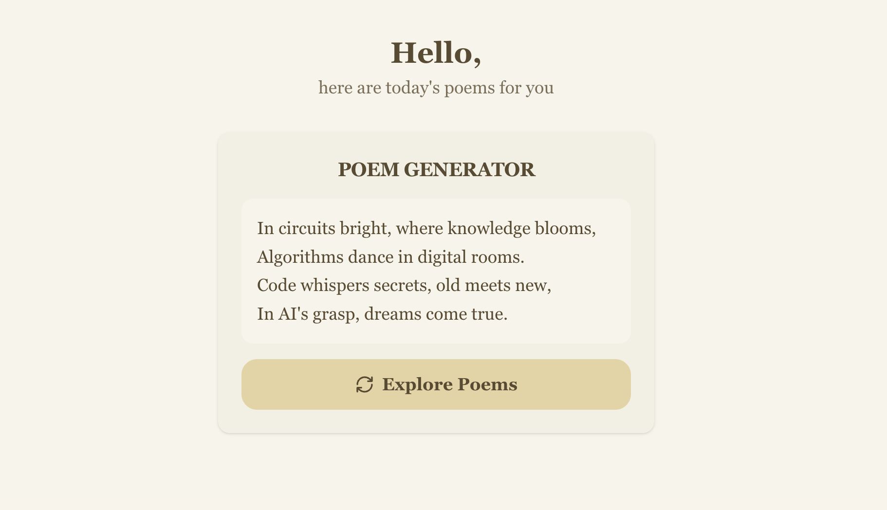

# Generador de Poemas con IA



Este proyecto consiste en una aplicación web que genera poemas cortos utilizando inteligencia artificial. Está compuesto por un frontend desarrollado en Next.js y un backend en FastAPI que utiliza el modelo GPT-4o de OpenAI para crear los poemas.

## Estructura del Proyecto

```
HW-1/
├── frontend/   # Interfaz de usuario (Next.js)
├── backend/    # API y lógica de generación de poemas (FastAPI)
```

---

## Frontend (Next.js)

- Permite al usuario generar y visualizar poemas cortos con solo presionar un botón.
- Utiliza componentes personalizados para mostrar los poemas de forma atractiva.
- Se comunica con el backend para obtener nuevos poemas generados por IA.
- Para iniciar el frontend:

```bash
cd frontend
npm install
npm run dev
```

Abre [http://localhost:3000](http://localhost:3000) en tu navegador para ver la aplicación.

---

## Backend (FastAPI)

- Expone una API REST que genera poemas usando el modelo GPT-4o de OpenAI.
- Endpoint principal: `/agent` (GET) — Devuelve un poema generado por IA.
- Endpoint `/agent/stream` — Devuelve el poema en modo streaming.
- Para iniciar el backend:

```bash
cd backend/llm
uvicorn app.main:app --reload --host 0.0.0.0 --port 8000
```

---

## Imagen de portada

La siguiente imagen ilustra el espíritu creativo del proyecto:


---

## Requisitos
- Node.js y npm para el frontend
- Python 3.10+ y FastAPI para el backend
- Una clave de API de OpenAI (configurada en variables de entorno)

---

## Créditos
- Inspirado en la creatividad de la IA y el aprendizaje automático. 
